# Backend Spring Boot – API E‑commerce

## Présentation du projet

Ce projet est une API REST développée avec **Spring Boot**, sécurisée par **JWT**, documentée avec **Swagger (OpenAPI)** et connectée à une base de données **MySQL**.

L’API permet de :

* Gérer les utilisateurs (inscription / connexion)
* Gérer les produits et catégories (admin)
* Passer et consulter des commandes


## Prérequis

* Java 17+
* Maven
* **XAMPP** (uniquement pour MySQL)
* Un navigateur web


## Installation de l’environnement MySQL avec XAMPP

### 1. Lancer XAMPP

* Démarrer **Apache** (optionnel)
* Démarrer **MySQL**

### 2. Accéder à phpMyAdmin

```
http://localhost/phpmyadmin
```

### 3. Création manuelle de la base de données

Créer une base de données nommée :

```
app_backend
```

* Encodage recommandé : `utf8mb4_general_ci`

Aucune table n’est à créer manuellement.
**Hibernate se charge automatiquement au premier lancement de creer les tables** (`spring.jpa.hibernate.ddl-auto=update`).


## Configuration de l’application

Fichier : `src/main/resources/application.properties`

```properties
spring.datasource.url=jdbc:mysql://localhost:3306/app_backend
spring.datasource.username=root
spring.datasource.password=

spring.jpa.hibernate.ddl-auto=update
spring.jpa.show-sql=true

server.port=8080
```


## Lancer le projet

Depuis la racine du projet :

```bash
mvn spring-boot:run
```

L’API sera disponible sur :

```
http://localhost:8080
```


## Accès à Swagger (documentation API)

Interface Swagger UI :

```
http://localhost:8080/swagger-ui/index.html
```

Documentation OpenAPI brute :

```
http://localhost:8080/v3/api-docs
```


## Authentification (JWT)

Certaines routes nécessitent un **Bearer Token**.

Après connexion, copier le token retourné et l’ajouter dans Swagger :

```
Authorization: Bearer <TOKEN>
```


## Ordre recommandé des requêtes

### 1. Inscription d’un utilisateur

`POST /api/auth/register`

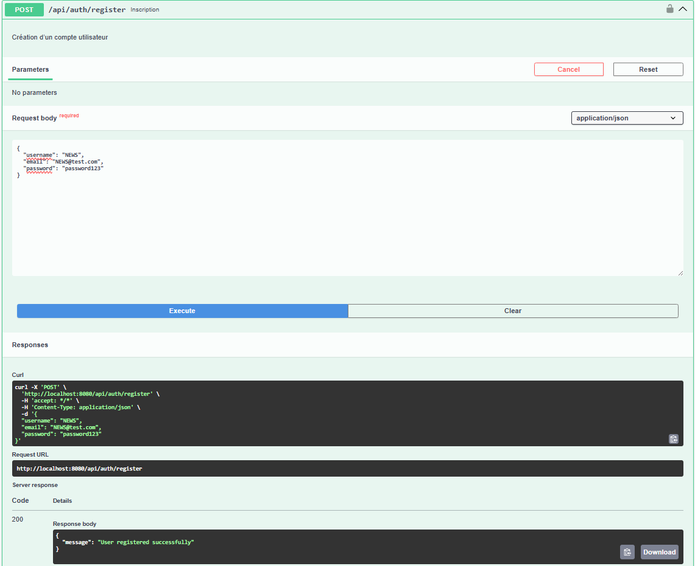

---

### 2. Connexion utilisateur

`POST /api/auth/login`

Récupérer le JWT

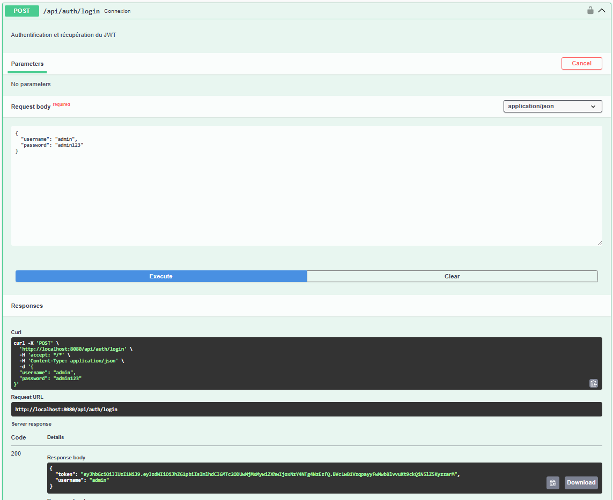

---

### 3. Liste des utilisateurs (ADMIN)

`GET /api/admin/users`

Token requis

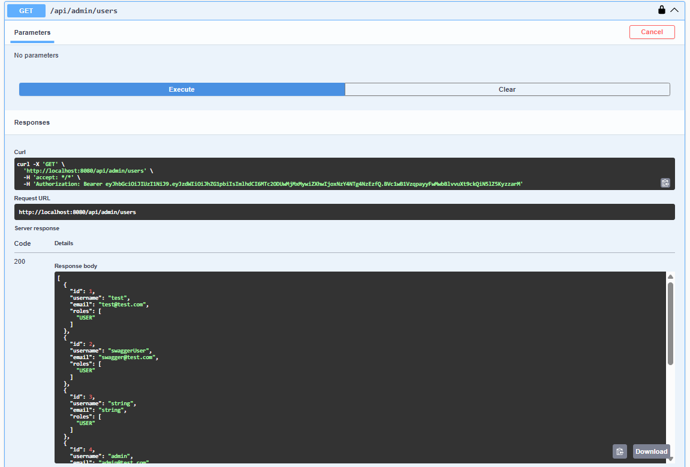

---

### 4. Changement de rôle d’un utilisateur (ADMIN)

`PUT /api/admin/users/{id}/role`

Token requis

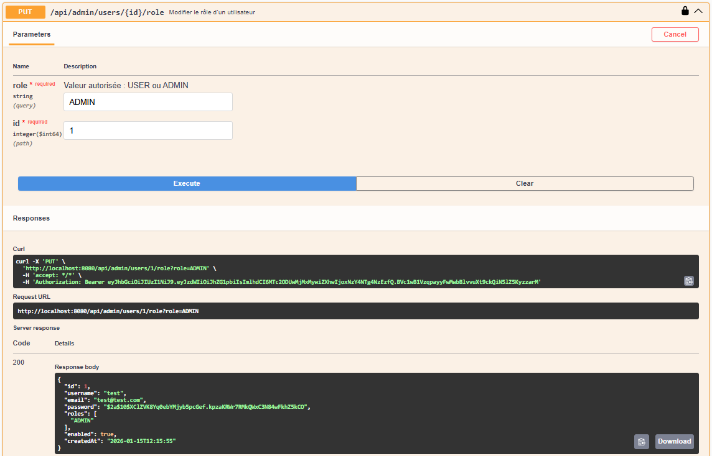

---

### 5. Création d’un produit (ADMIN)

`POST /api/admin/products`

Token requis

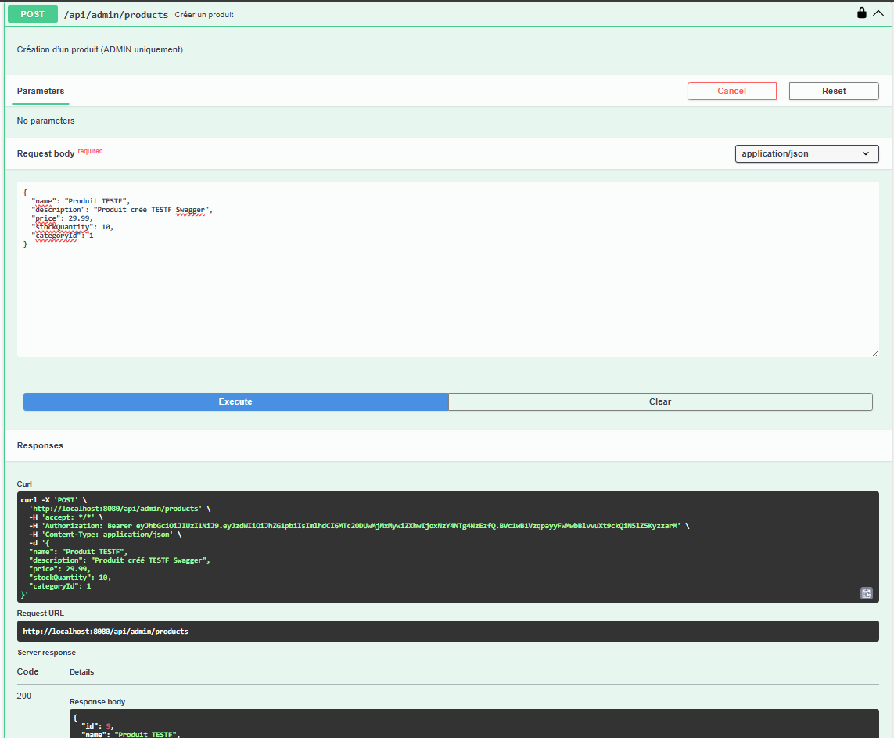

---

### 6. Modification d’un produit (ADMIN)

`PUT /api/admin/products/{id}`

Token requis

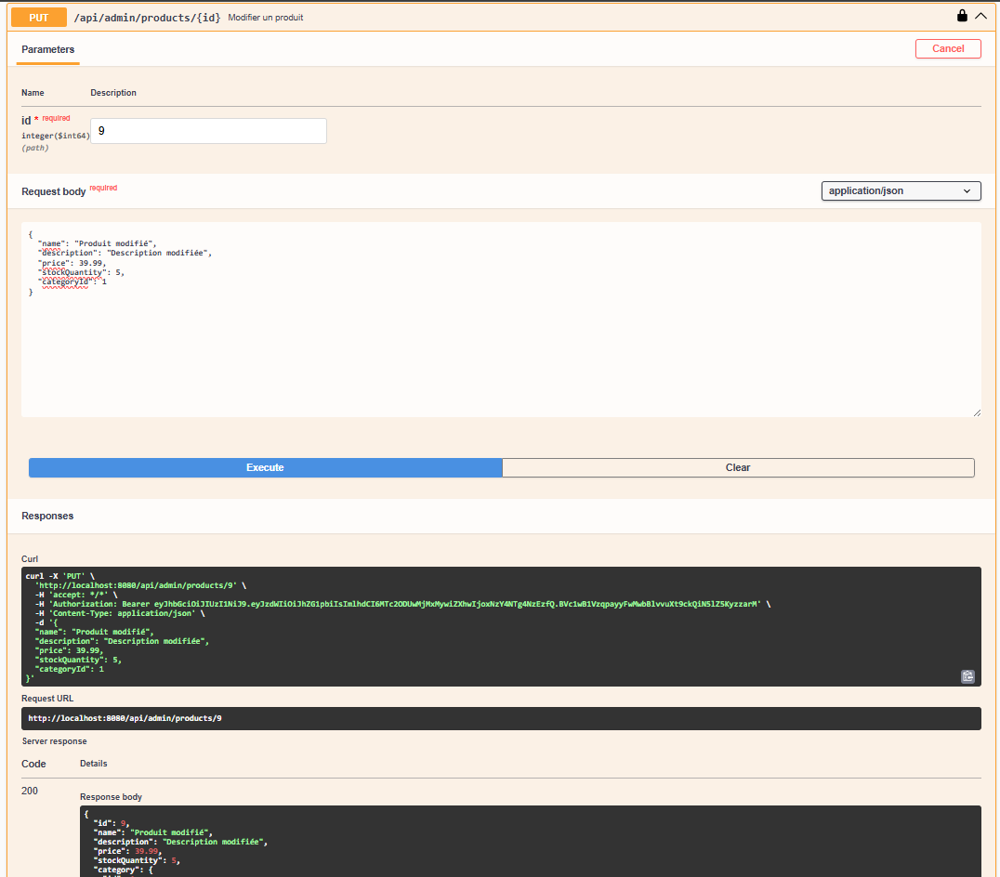

---

### 7. Suppression d’un produit (ADMIN)

`DELETE /api/admin/products/{id}`

Token requis

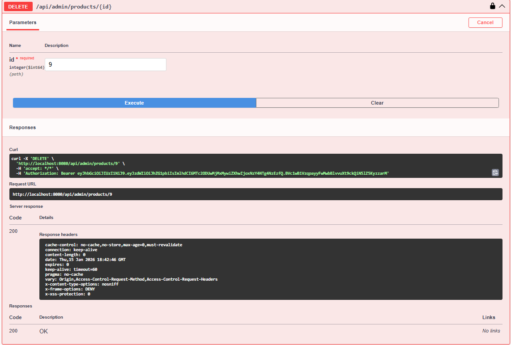

---

### 8. Liste des produits

`GET /api/products`

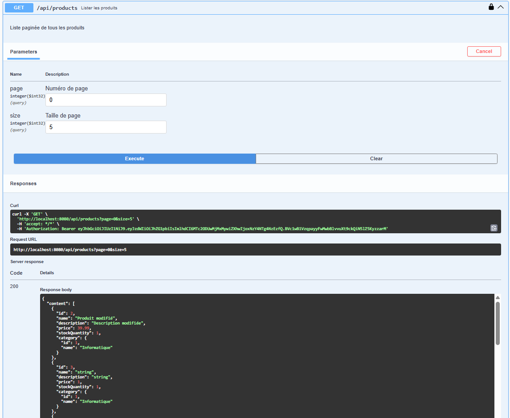

---

### 9. Recherche de produit

`GET /api/products/search`

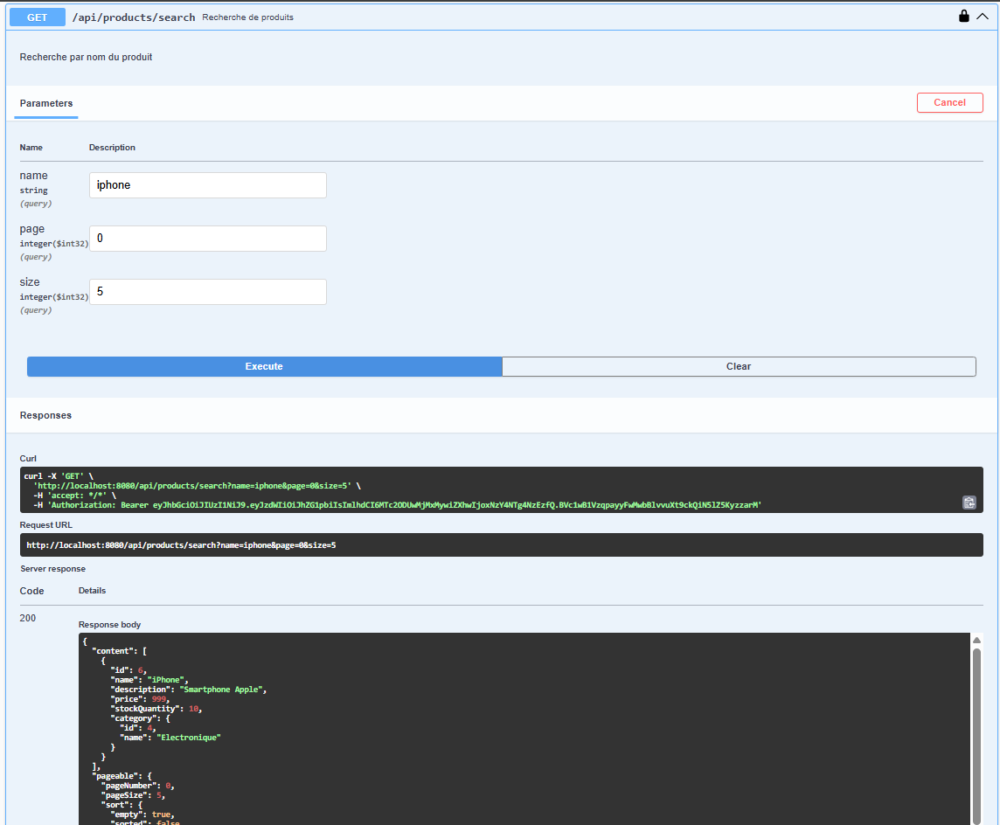

---

### 10. Détail d’un produit

`GET /api/products/{id}`

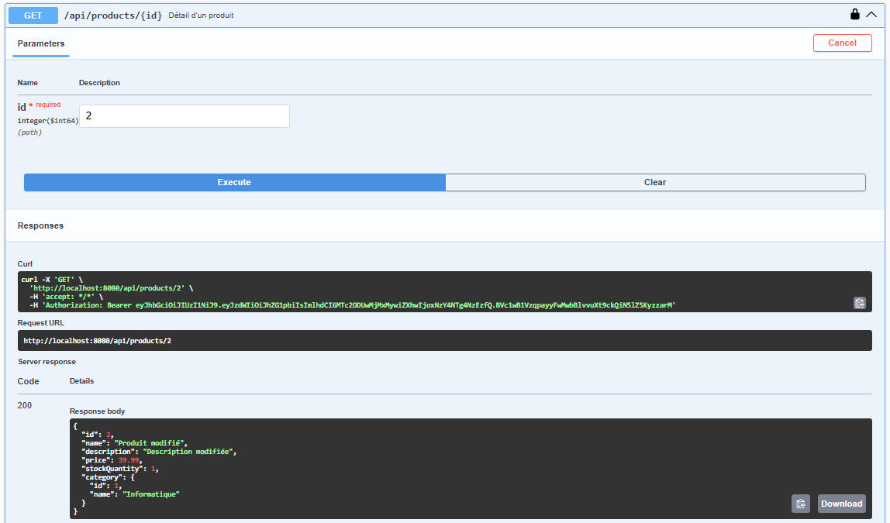

---

### 11. Création d’une commande

`POST /api/orders`

Token requis

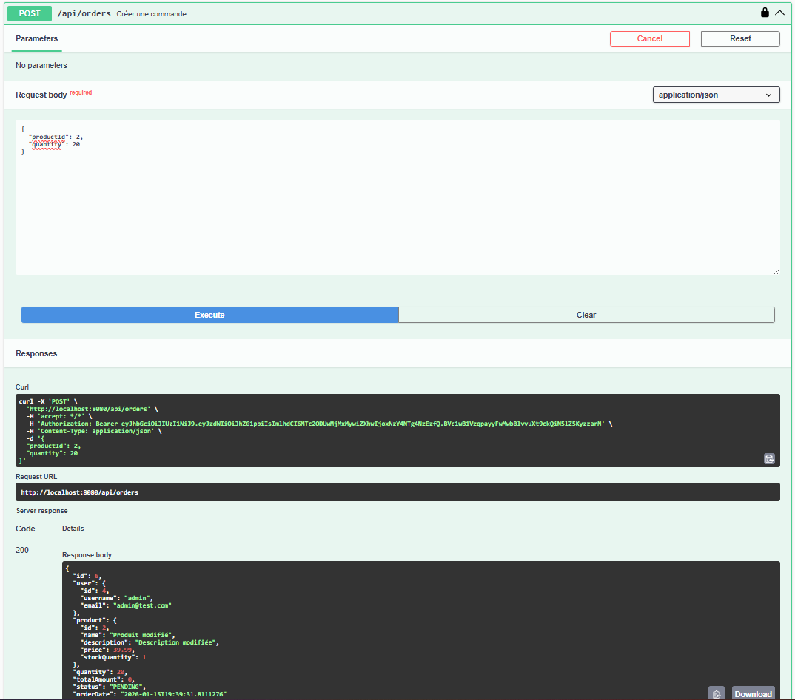

---

### 12. Consultation des commandes

`GET /api/orders`

Token requis

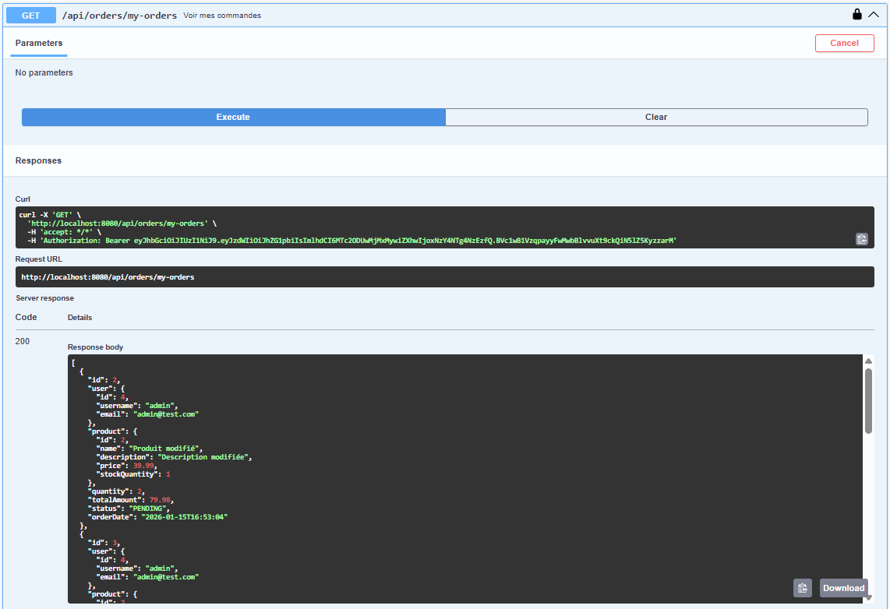

---

## Structure du projet

```
backend
├── controller
├── service
├── repository
├── entity
├── dto
├── config
├── security
└── docs
    └── screenshots
```

